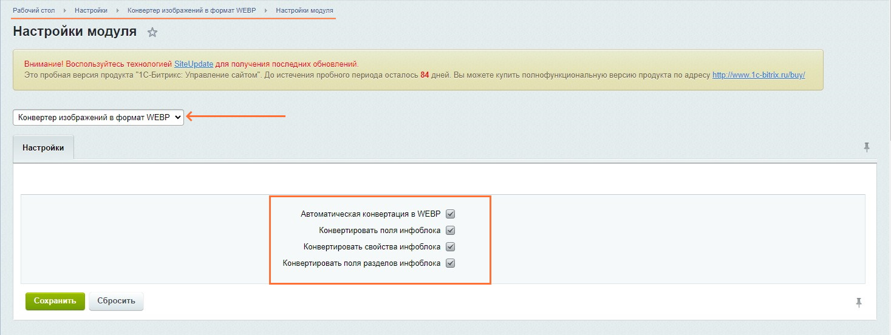
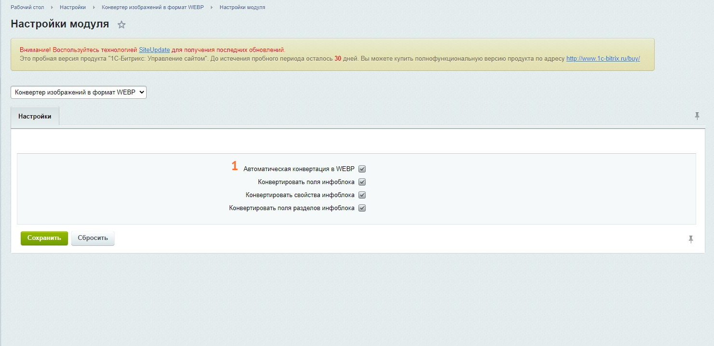
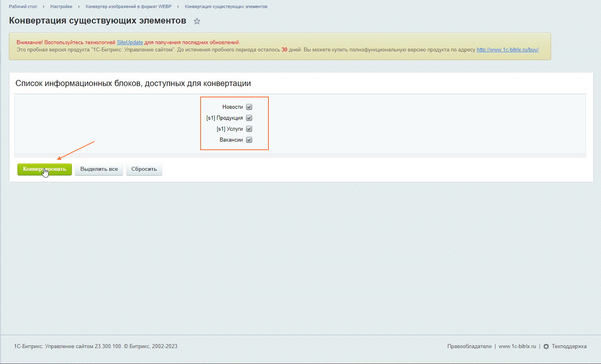
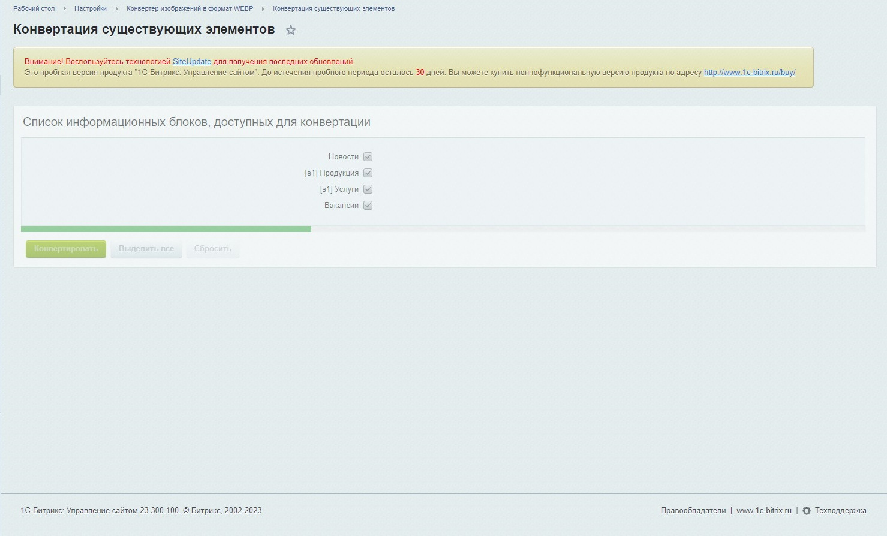
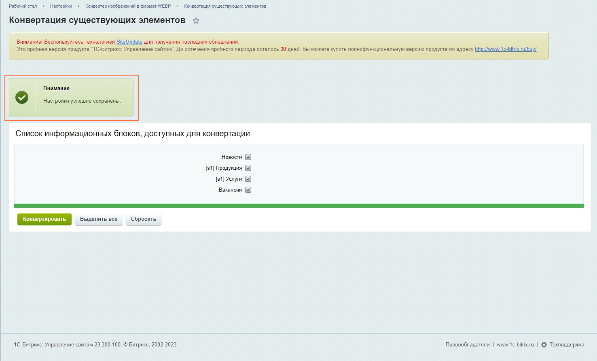
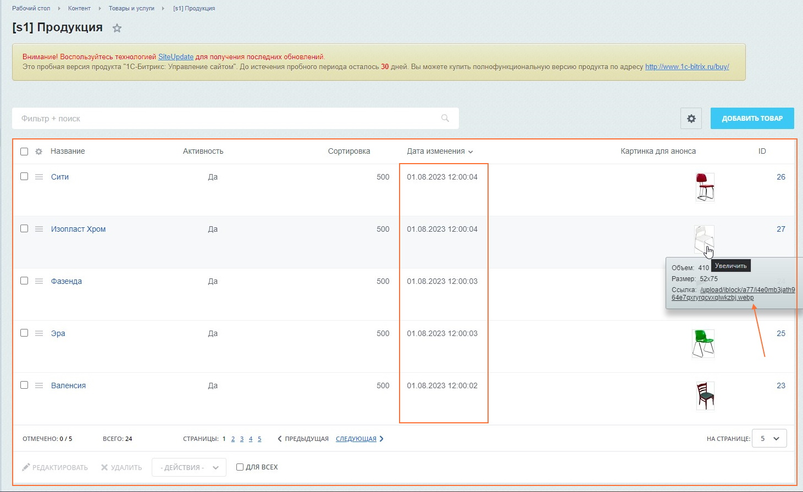
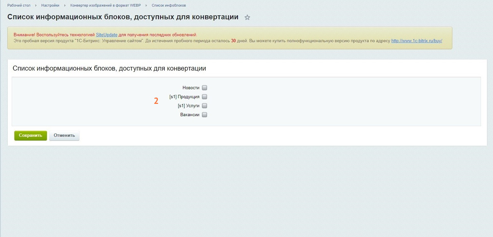
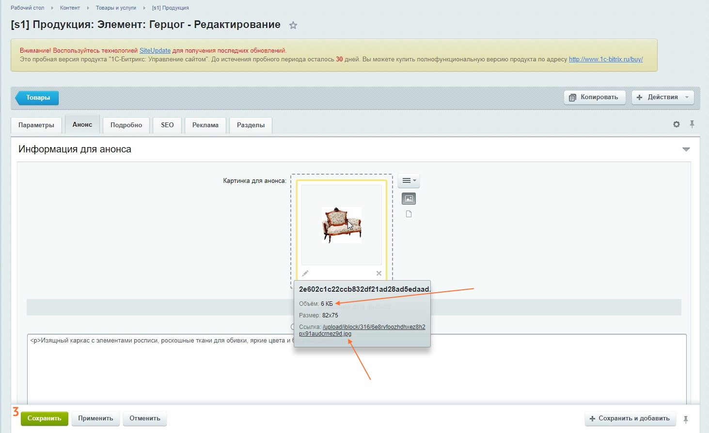
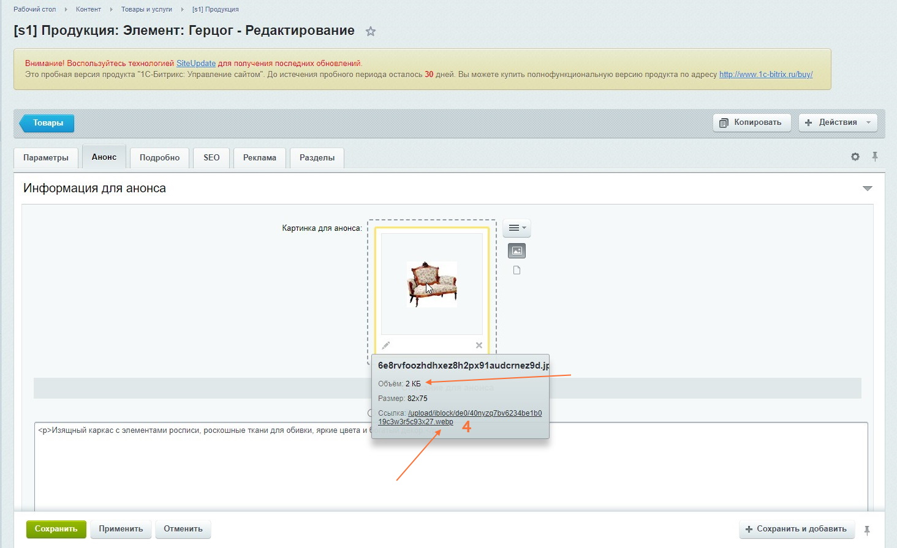

# Модуль конвертации изображений в формат WEBP

Инструмент для конвертации полей и/или свойств элементов и/или разделов инфоблока.

Гибкие настройки позволяют настроить автоматическую конвертацию изображений, а так же при
необходимости воспользоваться ручной конвертацией выбранных инфоблоков.

### Важно!
#### Конвертация не работает если изображение находится вне сайта

### Цель
Оптимизировать загрузку сайта путем оптимизации изображений, конвертацией в формат **webp**

### Поддерживаемые форматы
- **jpg/jpeg**
- **png**

### Функциональные возможности
- Автоматическая конвертация при событиях **OnAfter***
- Ручная конвертация ранее существующих элементов инфоблоков
- Гибкая настройка конвертации
    - Полей инфоблока
    - Свойств инфоблока
    - Полей разделов инфоблока
- Включение/Выключение автоматической конвертации
- Выбор качества сжатия

### Установка и настройка
1. Установить модуль (стандартная установка модуля из marketplace)
2. Установить нужные параметры модуля

### Ручная конвертация
1. Установить чекбоксы 2-4

2. Выделить нужные инфоблоки

3. Процесс конвертации

4. Конвертация изображений элементов прошла успешно

### Автоматическая конвертация

Пример для существующего элемента

* **Конвертация работает также и для новых элементов**

1. Установить чекбоксы

2. Разрешить автоматическую конвертацию для выбранных инфоблоков 

3. Элемент до обновления (ранее созданный) 

4. Элемент после сохранения 

### Используемые события
- [OnAfterIBlockElementAdd](https://dev.1c-bitrix.ru/api_help/iblock/events/onafteriblockelementadd.php)
- [OnAfterIBlockElementUpdate](https://dev.1c-bitrix.ru/api_help/iblock/events/onafteriblockelementupdate.php)
- [OnAfterIBlockSectionAdd](https://dev.1c-bitrix.ru/api_help/iblock/events/onafteriblocksectionadd.php)
- [OnAfterIBlockSectionUpdate](https://dev.1c-bitrix.ru/api_help/iblock/events/onafteriblocksectionupdate.php)

### Используемые библиотеки
- [rosell-dk/webp-convert](https://github.com/rosell-dk/webp-convert)
- [humbug/php-scoper](https://github.com/humbug/php-scoper)

&copy; 2023 «1С-Рарус» &reg;. Все права защищены.
